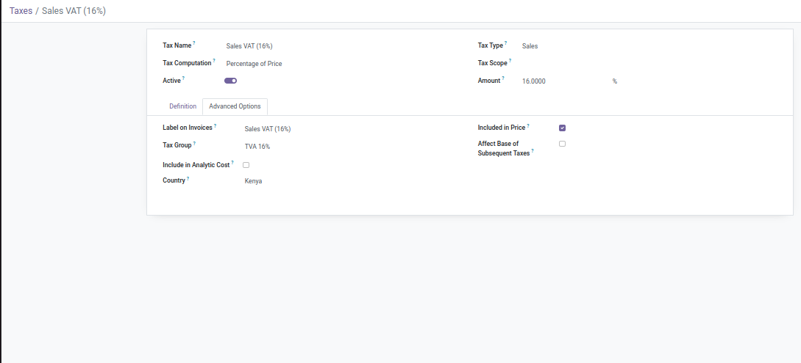
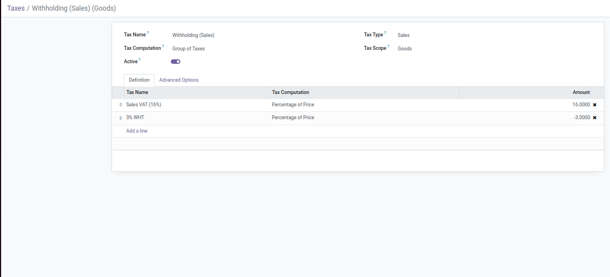
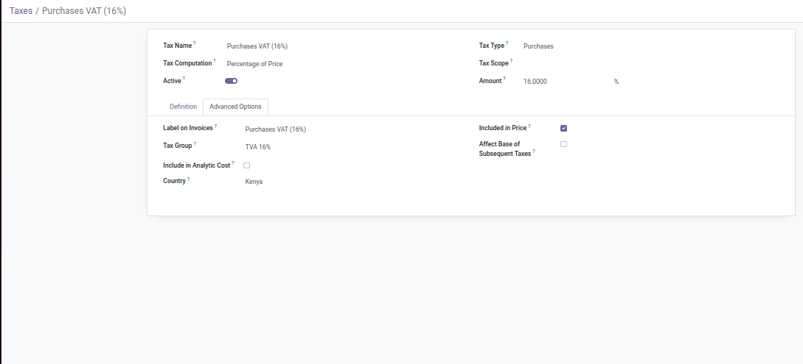
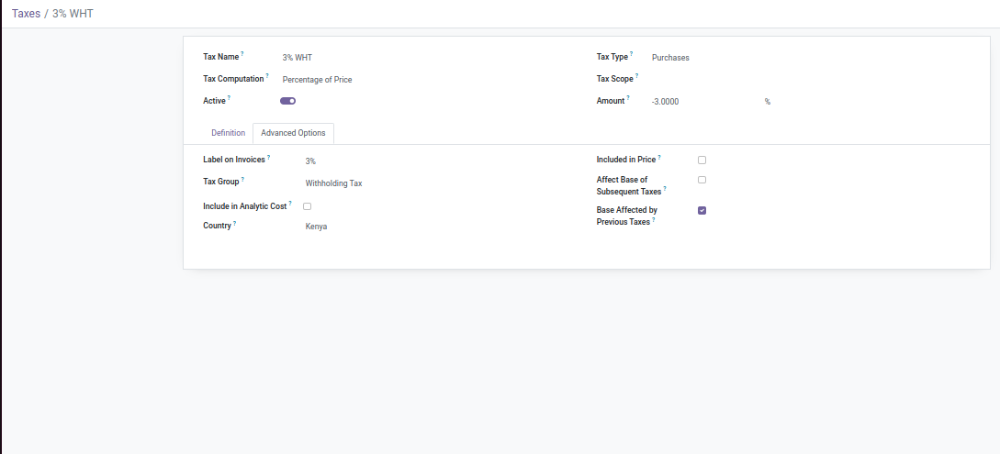
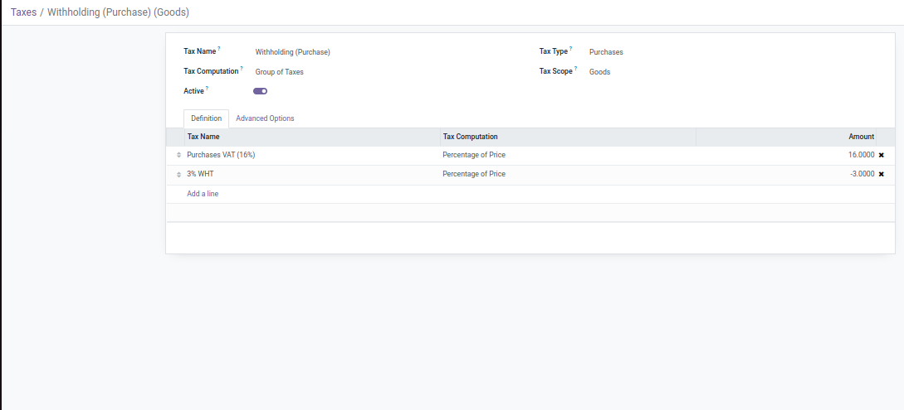

### installing wkhtmltox

To generate PDF reports, a module wkhtmltox needs to be installed. Use the commands:

> cd ~
>
> wget https://github.com/wkhtmltopdf/wkhtmltopdf/releases/download/0.12.4/wkhtmltox-0.12.4_linux-generic-amd64.tar.xz
>
>tar xvf wkhtmltox*.tar.xz
>
>sudo mv wkhtmltox/bin/wkhtmlto* /usr/bin
>
>sudo apt-get install -y openssl build-essential libssl-dev libxrender-dev git-core libx11-dev libxext-dev
> libfontconfig1-dev libfreetype6-dev fontconfig

## Mail Server Configuration Using App passwords in Odoo 16

1. Sign in to your Google Account
2. After the login process, go through the Account settings? Security?App Passwords.
3. Choose the app and the device for which you wish to create the app password.

4. Then, click on Generate and copy the password generated.

Now configure the mail server in Odoo using this password.
Only the admin user should be used to log in because they have access to all settings and configurations.

## **ODOO OUTGOING MAIL SERVER CONFIGURATION**

To configure outgoing mail servers, follow these breadcrumbs: **Settings ? Technical ?Email? outgoing mail servers.**

You will receive a form and you should provide the following details:

- SMTP Server: smtp.gmail.com
- SMTP port:The server's port(465)
- Connection Security: SSL/TLS
- Username: Your mail account
- Password:  The newly created app password
- Priority: The lower the number higher the priority

You can use the test connection smart button in the window to check the connectivity. A connection success complete
message will also be sent to you if the testing is successful.

## ODOO INCOMING MAIL SERVER CONFIGURATION

Follow these breadcrumbs to obtain the setup window for incoming email:Settings - **Technical - Email - Incoming Mail
Servers**

You will receive a form, and you should provide the following details:

- Server Type: IMAP Server
- Server name: The server's name. (imap.gmail.com)
- Port: The server's port(993)
- SSL/TLS:  Check this to encrypt messages
- Username: Your email address
- Password: The newly created app password

## Automated Actions

**Update Quantity on hand**

Model = stock.quant(Quants)

Trigger = On Update

Action To Do = Execute Python Code

```python

for record in records:
  if record._context.get('old_values'):
    old_vals = record._context['old_values'].get(record.id, {})
    new_quantity = record.inventory_quantity
    initial_quantity = record.quantity
    if 'inventory_quantity' in old_vals and new_quantity > 0:
          env['quantity.track'].create({
          'new_quantity': new_quantity,
          'initial_quantity': initial_quantity,
          'location': record.location_id.name,
          'company_name': record.company_id.name,
          'lot_id':record.lot_id.id,
          'inventory_date' :record.inventory_date,
          'in_date':record.in_date,
          'product_id': record.product_id.id,
          'user_id': env.user.id,
          'date_to': time.strftime('%Y-%m-%d'),
          'date_from':record.write_date
          })
```

**Update Sales Price**

Models = product.product and product.template(Product, Product Variant)

Trigger = On Update

Action To Do = Execute Python Code

 ```python
for record in records:
  currency_symbol = record.currency_id.symbol
  if record._context.get('old_values'):
    old_vals = record._context['old_values'].get(record.id, {})
    if 'list_price' in old_vals:
      env['sales.price.difference'].create({
        'product_id': record.product_variant_id.id,
        'old_price': old_vals['list_price'],
        'list_price': record.list_price,
        'user_id': env.user.id,
        'date_to': time.strftime('%Y-%m-%d'),
        'date_from':record.write_date
      })
      record.message_post(body="Sales Price changed from %s%.2f to %s%.2f" 
                          % (currency_symbol,
                             old_vals['list_price'],
                             currency_symbol,
                             record.list_price))
```

## Config File

```editorconfig
[options]
; This is the password that allows database operations:
admin_passwd = adminpassword
db_host = localhost
db_port = 5432
db_name = dbname
db_user = dbuser
db_password = dbpassword
addons_path = path to your addons
proxy_mode = True
xmlrpc_port = 8016
xmlrpc_interface = 127.0.0.1
timezone = Kenya
workers = 6
max_cron_threads = 2
server_wide_modules = web,queue_job

#-----------------------------------------------------------------------------
# Long polling port:
#    TCP port for long-polling connections in multiprocessing or gevent mode,
#    defaults to 8072. Not used in default (threaded) mode.
#-----------------------------------------------------------------------------
gevent_port = 8072

# 192.168.4.171
[queue_job]
channels = root:200,root.pos_picking_delayed:100


```

## Order Of Installation

1. Create a new Database
2. Configure settings
    - Log In: Use the administrator credentials you set up to log in to the newly created database.
    - Go to Settings:
      From the main dashboard, navigate to the "Settings" menu.

    1. Set Company Information:
       Go to "Companies" under the "General Settings" tab.
       Enter the company name and other relevant details.
    2. Set Country:
       Select your country to adjust localization settings (such as currency, date format, etc.).
       Save your changes.
3. Install the Invoicing Module then Accounting Module
4. Install the Tims Integration Module (l10n_ke_edi_tremol)
    - dk_accounting_tremol_integration
5. Install Sales Module
6. Install Contacts Module
7. Install Inventory and Purchase Modules
8. Automated Workflows
    - Purchase Order Automation Module
    - Sale Automatic Workflow Module
    - Set Shipping Weight on Sale Order Module
    - Reserve Quantities Module
9. Configure Multi-step routes on multiple warehouses
10. Install Purchase History Module
11. Set Fiscal Positions
12. Configure Taxes
13. Withholding Taxes
14. Install the Reporting Module. It installs the following modules:
    - Statement Reports Module(journal items report)
    - All Sales Report Module
    - Withholding Tax Report Module
    - Return Merchandise Authorization Module
    - Internal Consumption Module
    - Product Stock Card Report
    - Inventory Ledger Report
    - Import Stock Inventory
    - Internal Stock Transfer
15. Install Pos Module
    - POS and Sales Reports Module
    - Phone Payments Module
    - dk_custom_receipts_for_pos Module
    - dk_pos_return_orders
    - dk_pos_picking_delayed
    - dk_pos_tremol_integration
16. Install Automated Action Rules Module and create automated actions
17. Set the default sales and purchase tax in the Accounting settings
18. Configure any additional settings


- Employee Contract Types Module
- Payroll Module
- HR Payroll Module
- HR Payroll Accounting Module
- Payroll Accounting Module
- Payroll Reports Module

# Tax Configuration

**Sales**




**Purchases**




   

